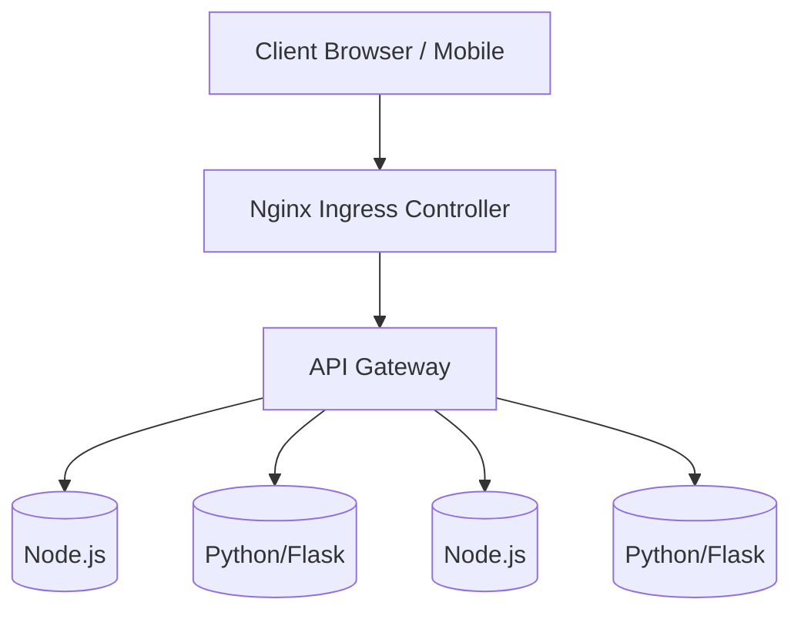

# Ecommerce Microservices Architecture

This document outlines the architecture for the ecommerce application.

## High Level Architecture

```mermaid
graph TD
    Client[Client Browser / Mobile] --> Ingress[Nginx Ingress Controller]
    Ingress --> Gateway[API Gateway]
    
    Gateway --> User[User Service]
    Gateway --> Product[Product Service]
    Gateway --> Order[Order Service]
    Gateway --> Payment[Payment Service]
    
    User[(Node.js)]
    Product[(Python/Flask)]
    Order[(Node.js)]
    Payment[(Python/Flask)]
```

## CI/CD Pipeline

```mermaid
graph LR
    Code[GitHub] --> CI[GitHub Actions CI]
    CI --> Test[Run Tests]
    Test --> Scan[Trivy Scan]
    Scan --> Build[Docker Build]
    Build --> Push[Push to ACR]
    Push --> CD[Azure DevOps Release]
    CD --> Green[Deploy Green]
    Green --> Smoke[Smoke Tests]
    Smoke --> Switch[Switch Traffic]
```
